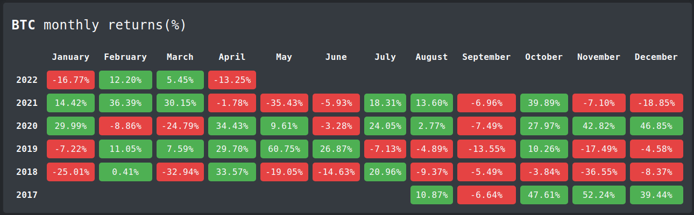

# 🤑 Returnator Adventures

Monthly crypto-currency returns based on historical data provided by Binance API.

## Features

🚧 **This project is still under construction**, you may encounter bugs and other strange behavior.

- [x] Preload of the top 10 crypto-currencies, harcoded value
- [x] Load more button, displays the next 10 crypto-currencies, the display order is provided by the API
- [x] Filters the crypto-currencies already displayed, it kinda works
- [x] Monthly return calculation
- [x] Mobile friendlyness, it kinda works
- [ ] Refactor the code to make it great again
- [ ] Display crypto-currencies ordered by volume
- [ ] Unit test

## Resources

- [Binance API documentation](https://binance-docs.github.io/apidocs/)
- [Open Props](https://open-props.style/) supercharged CSS variables.
